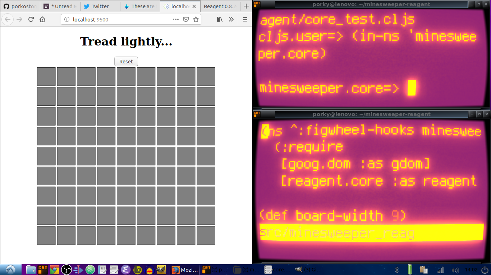

# minesweeper-reagent

Live app [here](https://porkostomus.github.io/minesweeper-reagent/).
Interactive code and explanation in this [post](https://porkostomus.gitlab.io/posts-output/2018-10-23-minesweeper/).

Screenshot:

To get an interactive development environment run:

    lein fig:build

This will auto compile and send all changes to the browser without the
need to reload. After the compilation process is complete, you will
get a Browser Connected REPL. An easy way to try it is:

    (js/alert "Am I connected?")

and you should see an alert in the browser window.

To clean all compiled files:

	lein clean

To create a production build run:

	lein clean
	lein fig:min
